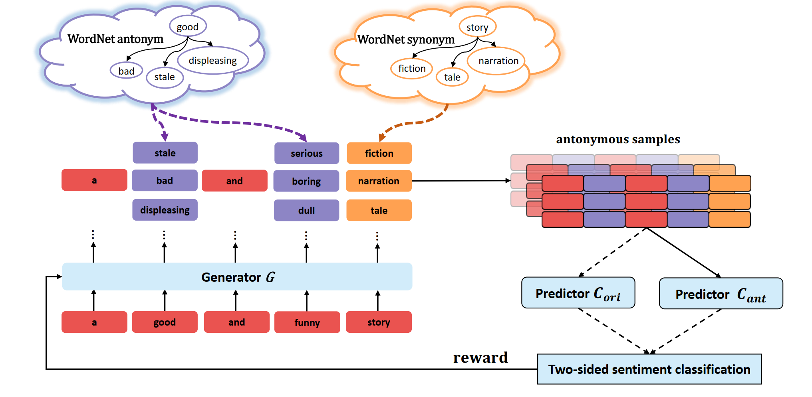

# Reinforced Counterfactual Data Augmentation for Dual Sentiment Classification

This repository contains code for our EMNLP2021 paper: 

[Reinforced Counterfactual Data Augmentation for Dual Sentiment Classification](https://aclanthology.org/2021.emnlp-main.24.pdf)


## Datasets

We conduct experiments on four benchmark datasets for sentence-level sentiment classification, namely, SST-2, SST-5, RT and Yelp. For Yelp we sample 100K data as
the training set, 10K as the validation set, and 10K for testing. And all the datasets have been uploaded to data folder.

## Usage

```
python train.py
```
And you can change the dataset in config.py, other hyperparametric can also be modified in this file.


## Methods

he overall architecture of our joint counterfactual data generation and dual sentiment classification framework. The left part is the generator, which acts as an agent in reinforcement learning, and the right side is the discriminator containing two sentiment predictors. 

<p align="center">
  
</p>
<!--  -->


## Citation
If you use the data and code in your research, please cite our paper as follows:
```
@inproceedings{chen-etal-2021-reinforced,
    title = "Reinforced Counterfactual Data Augmentation for Dual Sentiment Classification",
    author = "Chen, Hao  and
      Xia, Rui  and
      Yu, Jianfei",
    booktitle = "Proceedings of the 2021 Conference on Empirical Methods in Natural Language Processing",
    year = "2021",
    pages = "269--278",
}
```
